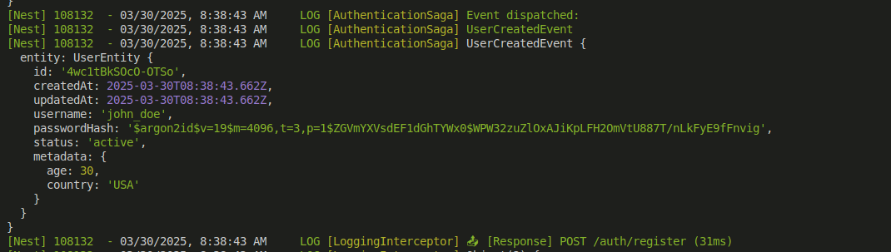

# CQRS Authentication RBAC Module for NestJS
This module provides Role-Based Access Control (RBAC) authentication using CQRS in a NestJS application. It integrates with PostgreSQL and uses JWT for authentication.

## Features
### Authentication Features

- ✅ **User Registration** – Allow users to sign up (email/password, social login, etc.).
- ✅ **User Login** – Authenticate users with secure methods (JWT, OAuth, session-based).
- ✅ **Token Management** – Use access & refresh tokens (JWT-based or session).
- ✅ **Multi-Factor Authentication (MFA)** – Optional for added security.
- ✅ **Password Reset & Recovery** – Enable users to recover their accounts.
- ✅ **Session Management** – Handle multiple active sessions & logout.

### Role-Based Access Control (RBAC) Features

- ✅ **Role Management** – Create, update, and delete roles (e.g., Admin, User, Editor).
- ✅ **Permission Management** – Assign permissions to roles (e.g., read, write, delete).
- ✅ **User-Role Assignment** – Map users to one or multiple roles.
- ✅ **Fine-Grained Access Control** – Restrict access based on permissions.
- ✅ **Middleware/Guards** – Enforce role-based access in API endpoints or UI components.

### Security & Compliance

- ✅ **Secure Password Hashing** – Use bcrypt, Argon2, or PBKDF2.
- ✅ **Rate Limiting & Brute Force Protection** – Prevent login abuse.
- ✅ **Audit Logging** – Track authentication & authorization actions.
- ✅ **RBAC Configuration Storage** – Store roles/permissions in DB, cache, or config.
- ✅ **Granular Access Policies** – Allow resource-level access control.

## Installation

Ensure you have NestJS installed in your project. Then, install the required dependencies:

```sh
npm i cqrs-authentication-rbac
```
## Usage
### Register the Module

Import and configure the module in your NestJS application:

```typescript
/**
 * AppModule configuration for the CQRSAuthenticationRBAC module.
 *
 * This module is configured to handle authentication and RBAC (Role-Based Access Control)
 * using the `cqrs-authentication-rbac` package. Below are the details of each configuration field:
 *
 * - `dbConf`: Database configuration for connecting to the PostgreSQL database.
 *   - `host`: The database host (default: 'localhost').
 *   - `port`: The database port (default: 5432).
 *   - `user`: The database username (default: 'postgres').
 *   - `password`: The database password (default: 'postgres').
 *   - `database`: The name of the database (default: 'postgres').
 *
 * - `jwtOptions`: Configuration for JSON Web Token (JWT) handling.
 *   - `secret`: The secret key used to sign JWTs (default: 'defaultSecret').
 *   - `signOptions`: Options for signing JWTs.
 *     - `expiresIn`: The expiration time for JWTs (default: '60s').
 *
 * - `rbacConf`: Configuration for Role-Based Access Control (RBAC).
 *   - `authSecretKey`: Secret key for authentication (default: 'defaultAuthSecretKey').
 *   - `authSalt`: Salt used for authentication (default: 'defaultAuthSalt').
 *   - `authJwtSecret`: Secret key for JWT authentication (default: 'defaultAuthJwtSecret').
 *   - `authAccessTokenSecretKey`: Secret key for access tokens (default: 'defaultAccessTokenSecretKey').
 *   - `authRefreshTokenSecretKey`: Secret key for refresh tokens (default: 'defaultRefreshTokenSecretKey').
 *   - `authAccessTokenExpiresIn`: Expiration time for access tokens (default: '3600s').
 *   - `authRefreshTokenExpiresIn`: Expiration time for refresh tokens (default: '86400s').
 *   - `authTokenType`: Type of token used for authentication (default: 'Bearer').
 *
 * - `migrations`: Configuration for database migrations.
 *   - `enable`: Whether migrations are enabled (default: true).
 *   - `migrationTableName`: The name of the table used to track migrations (default: '_migration_authentication').
 *
 * - `constroller`: Configuration for enabling the controller.
 *   - `enable`: Whether the controller is enabled (default: true).
 */
import { Module } from '@nestjs/common';
import { CQRSAuthenticationRBAC } from 'cqrs-authentication-rbac';

@Module({
  imports: [
    CQRSAuthenticationRBAC.register({
      dbConf: {
        host: process.env.PG_MAIN_DB_HOST || 'localhost',
        port: parseInt(process.env.PG_MAIN_DB_PORT || '5432', 10),
        user: process.env.PG_MAIN_DB_USER || 'postgres',
        password: process.env.PG_MAIN_DB_PASSWORD || 'postgres',
        database: process.env.PG_MAIN_DB_DATABASE || 'postgres',
      },
      jwtOptions: {
        secret: process.env.JWT_SECRET || 'defaultSecret',
        signOptions: { expiresIn: '60s' },
      },
      rbacConf: {
        authSecretKey: process.env.AUTH_SECRET_KEY || 'defaultAuthSecretKey',
        authSalt: process.env.AUTH_SALT || 'defaultAuthSalt',
        authJwtSecret: process.env.AUTH_JWT_SECRET || 'defaultAuthJwtSecret',
        authAccessTokenSecretKey:
          process.env.AUTH_ACCESS_TOKEN_SECRET_KEY ||
          'defaultAccessTokenSecretKey',
        authRefreshTokenSecretKey:
          process.env.AUTH_REFRESH_TOKEN_SECRET_KEY ||
          'defaultRefreshTokenSecretKey',
        authAccessTokenExpiresIn:
          process.env.AUTH_ACCESS_TOKEN_EXPIRES_IN || '3600s',
        authRefreshTokenExpiresIn:
          process.env.AUTH_REFRESH_TOKEN_EXPIRES_IN || '86400s',
        authTokenType: process.env.AUTH_TOKEN_TYPE ?? 'Bearer',
      },
      migrations: {
        enable: true,
        migrationTableName: '_migration_authentication',
      },
      constroller: {
        enable: true,
      },
    }),
  ],
})
export class AppModule {}
```

### Available Bussiness logic
- Let's me write doc after finish verion 3.0.0

#### Description
#### Register

The `Register` endpoint allows a new user to create an account by providing a username, password, and optional metadata. Upon successful registration, the server returns the user's details, including a unique ID, timestamps, and hashed password.

#### HTTP Request
**POST** `/auth/register`

#### Headers
- `accept: */*`  
- `Content-Type: application/json`

#### Request Body
The request body must be a JSON object containing the following fields:
- `username` (string, required): The desired username for the new account.
- `password` (string, required): The password for the new account.
- `metadata` (object, optional): Additional user information.
  - `age` (integer, optional): The user's age.
  - `country` (string, optional): The user's country of residence.
#### Event


- **UserCreatedEvent**: Triggered when a new user is created. you can trigger this event to handle your custom business (Send email, Notify,...)


### Login API Documentation

#### Endpoint
`POST /auth/login`

#### Description
This endpoint allows a user to log in by providing their username and password. Upon successful authentication, the server responds with user details, an access token, and a refresh token.

#### Request
- **URL**: `http://localhost:3000/auth/login`
- **Method**: `POST`
- **Headers**:
  - `accept: */*`
  - `Content-Type: application/json`
- **Request Body**:
  ```json
  {
    "username": "john_doe",
    "password": "strongPassword123"
  }
  ```

#### Response
- **Status Code**: `200 OK`
- **Response Body**:
  ```json
  {
    "user": {
      "id": "4wc1tBkSOcO-OTSo",
      "createdAt": "2025-03-30T08:38:43.662Z",
      "updatedAt": "2025-03-30T08:38:43.662Z",
      "username": "john_doe",
      "metadata": {
        "age": 30,
        "country": "USA"
      }
    },
    "accessToken": "eyJhbGciOiJIU...",
    "refreshToken": "eyJhbGciOiJIUzI..."
  }
  ```

#### Notes
- The `accessToken` is used for authenticated requests to protected endpoints.
- The `refreshToken` can be used to obtain a new access token when the current one expires.
- Ensure that sensitive information such as `passwordHash` is handled securely and not exposed unnecessarily.

### Refresh Token API
This API endpoint is used to refresh an access token using a valid refresh token.

#### Endpoint
`POST /auth/refresh-token`

#### Headers
- `accept: */*` - Specifies that the client accepts any response format.
- `Content-Type: application/json` - Indicates that the request body is in JSON format.

#### Me

#### TODO:

#### User Events

- **UserLogedinEvent**: Triggered when a user successfully logs in.
- **UserLoginFailEvent**: Triggered when a user login attempt fails.
- **UserUpdatedEvent**: Triggered when a user's details are updated.
- **UserDeletedEvent**: Triggered when a user is deleted.

#### Role Events

- **UserRoleEntityCreatedEvent**: Triggered when a new user role entity is created.
- **UserRoleUpdatedEvent**: Triggered when a user role is updated.
- **UserRoleDeletedEvent**: Triggered when a user role is deleted.
- **EndpointsAddedToRolesEvent**: Triggered when endpoints are added to specific roles.
- **PermissionsUpdatedForRoleEvent**: Triggered when permissions are updated for a role.

#### Endpoint Events

- **EndpointEntityCreatedEvent**: Triggered when a new endpoint entity is created.
- **EndpointEntityUpdatedEvent**: Triggered when an endpoint entity is updated.
- **EndpointEntityDeletedEvent**: Triggered when an endpoint entity is deleted.
- **EndpointAccessedEvent**: Triggered when an endpoint is accessed.
- **EndpointPermissionUpdatedEvent**: Triggered when permissions for an endpoint are updated.

#### Action Events

- **ActionTriggeredEvent**: Triggered when a specific action is performed by a user.
- **ActionFailedEvent**: Triggered when an action fails to execute.
- **ActionCompletedEvent**: Triggered when an action is successfully completed.

### Role-Based Authorization

- Let's me write doc after finish verion 3.0.0

## License

MIT
